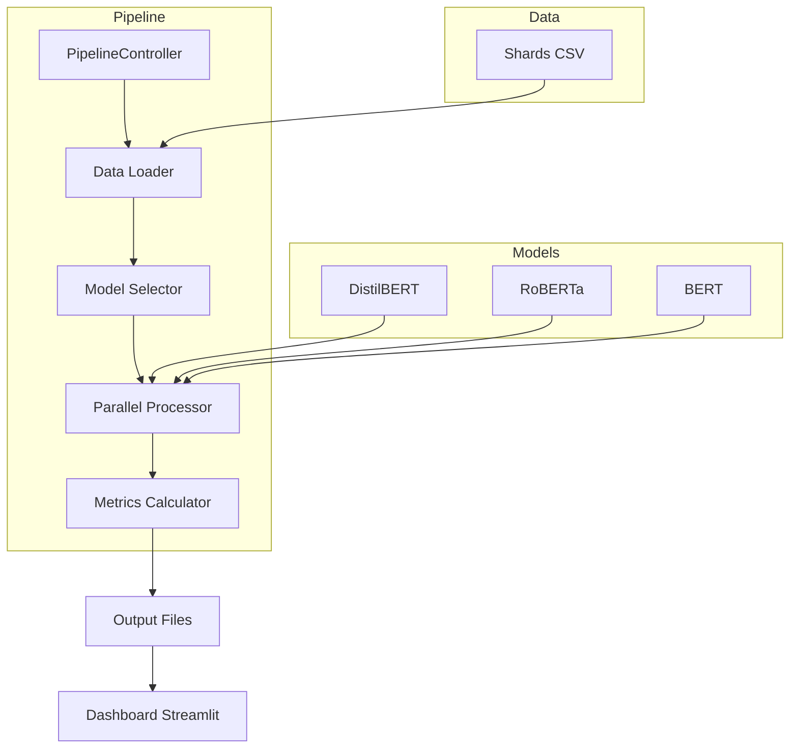
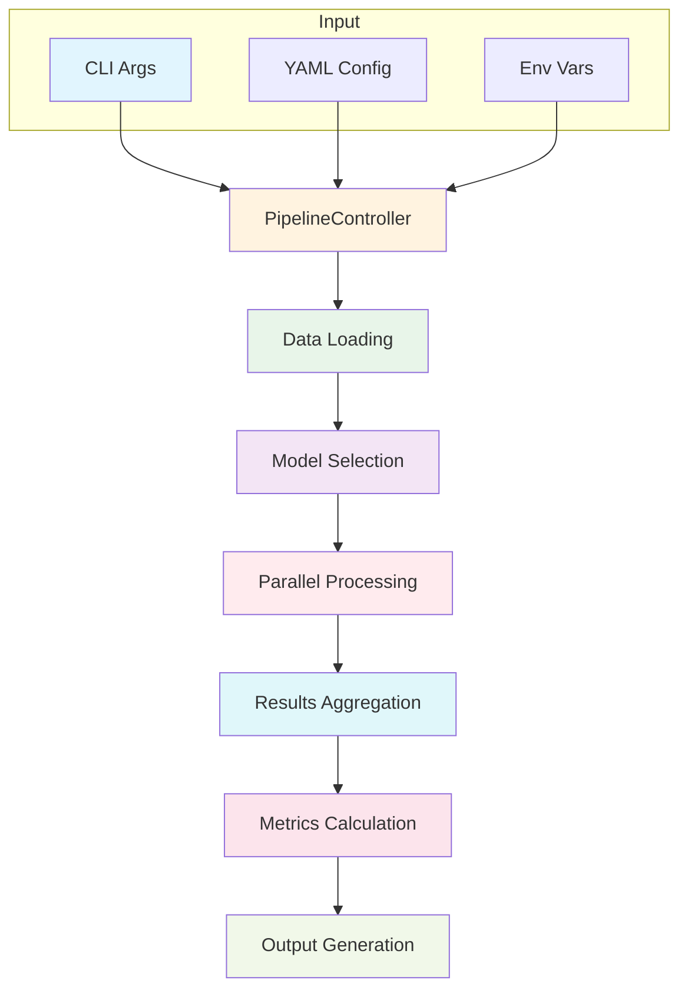
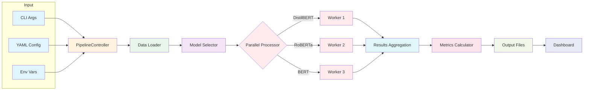
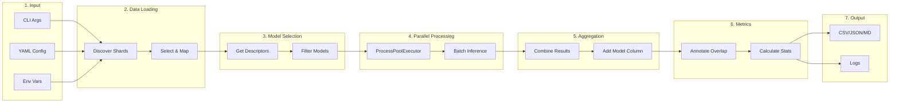

# QA Pipeline Modular - Análise de Question Answering

Uma pipeline robusta, modular e paralela para processar e analisar respostas de múltiplos modelos de Question Answering (QA) usando a plataforma Hugging Face.

## 📋 Sumário

- [Características](#características)
- [Arquitetura](#arquitetura)
- [Fluxo de Dados](#fluxo-de-dados)
- [Dashboard Streamlit](#dashboard-streamlit)
  - [Estrutura de Páginas](#estrutura-de-páginas)
  - [Características do Dashboard](#características-do-dashboard)
  - [Como Executar o Dashboard](#como-executar-o-dashboard)
  - [Componentes do Dashboard (Home)](#componentes-do-dashboard-home)
  - [Componentes do Dashboard (Análises Avançadas)](#componentes-do-dashboard-análises-avançadas)
- [Modelos Disponíveis](#modelos-disponíveis)
- [Métricas](#métricas)
- [Instalação](#instalação)
- [Uso](#uso)
- [Exemplos](#exemplos)
- [Estrutura de Saídas](#estrutura-de-saídas)
- [Configuração](#configuração)
- [Testes](#testes)
- [Estrutura de Projeto](#estrutura-de-projeto)
- [Troubleshooting](#troubleshooting)

---

## ✨ Características

- **Modular**: Arquitetura baseada em componentes independentes e reutilizáveis
- **Paralelo**: Processamento simultâneo de múltiplos modelos usando `ProcessPoolExecutor`
- **Batch Processing Otimizado**: Inferência em batch real para 2-5x mais performance
- **Flexível**: Seleção de shards e modelos via CLI ou arquivo YAML
- **Dashboard Multipáginas**: Interface Streamlit com múltiplas páginas (Home + Análises Avançadas)
- **Sistema de Cores Avançado**: ColorManager para personalização de cores por modelo
- **Logging estruturado**: Rastreamento detalhado de execução com timestamps
- **Métricas abrangentes**: Análise de confiança, overlap palavra-contexto, concordância entre modelos
- **Tamanho de Querys**: Métricas de tamanho médio por palavra e por letra
- **Exportação multi-formato**: Resultados em CSV, JSON, Markdown (suporta .csv.gz)
- **Testes automatizados**: Cobertura de componentes principais
- **Poetry**: Gerenciamento de dependências via Poetry

---

## 🏗️ Arquitetura

### Componentes Principais



### Visão Detalhada do Fluxo



### Componentes Detalhados

#### 1. **ShardLoader** (`src/data_loader.py`)
- Descobre e carrega shards CSV do diretório `data/shards/`
- Suporta seleção por padrão glob, lista ou "all"
- Adiciona coluna `_shard` para rastreamento de origem
- Suporta mapeamento de colunas alternativas (`query`→`question`, `text`→`context`)

#### 2. **ModelSelector** (`src/model_selector.py`)
- Registro centralizado de modelos QA disponíveis
- Descritores dinâmicos contendo `key`, `class`, `hf_name`
- Seleção por nome ou "all"

#### 3. **ParallelProcessor** (`src/parallel_processor.py`)
- Executa modelos em processos paralelos separados
- Cada worker instancia um pipeline HF localmente
- **Batch processing real**: Otimizado para inferência em lote (2-5x mais rápido)
- Suporta CUDA quando disponível

#### 4. **PipelineController** (`src/pipeline_controller.py`)
- Orquestração centralizada do fluxo
- Carregamento de dados → Seleção de modelos → Processamento paralelo → Agregação → Métricas
- Mapeamento automático de esquemas de entrada
- Salvamento de resultados consolidados

#### 5. **MetricsCalculator** (`src/metrics_calculator.py`)
- Cálculo de métricas gerais e por-modelo
- Anotação de overlap palavra-contexto
- Categorização de confiança
- Geração de relatórios (JSON, Markdown, CSV)

#### 6. **BaseQAModel** (`src/base_model.py`)
- Classe abstrata para wrappers de modelos
- Define interface: `load_model()`, `predict()`, `get_metadata()`
- Implementações concretas:
  - `DistilBERTModel`: modelo leve baseado em BERT
  - `RobertaModel`: modelo mais robusto
  - `BERTModel`: BERT completo (Option A - large version)

---

## 🔄 Fluxo de Dados

### Fluxo de Execução



### Pipeline de Processamento Detalhado



### Exemplo de Transformação de Dados

**Entrada (data/shards/shard_001.csv):**
```csv
query,text
What is Python?,Python is a programming language
Who invented Python?,Guido van Rossum created Python
```

**Após ShardLoader:**
```csv
question,context,_shard
What is Python?,Python is a programming language,shard_001.csv
Who invented Python?,Guido van Rossum created Python,shard_001.csv
```

**Após ParallelProcessor (ex: DistilBERT):**
```csv
question,context,answer,score,model,_shard
What is Python?,Python is a programming language,Python,0.95,distilbert,shard_001.csv
Who invented Python?,Guido van Rossum created Python,Guido van Rossum,0.92,distilbert,shard_001.csv
```

**Após MetricsCalculator.annotate_overlap:**
```csv
question,context,answer,score,model,_shard,overlap_count,overlap_fraction
What is Python?,Python is a programming language,Python,0.95,distilbert,shard_001.csv,1,1.0
Who invented Python?,Guido van Rossum created Python,Guido van Rossum,0.92,distilbert,shard_001.csv,2,1.0
```

---

## 📊 Dashboard Streamlit

O projeto inclui um dashboard interativo desenvolvido em Streamlit para análise visual dos resultados do pipeline QA.

### Estrutura de Páginas

O dashboard é organizado em múltiplas páginas:

| Página | Arquivo | Descrição |
|--------|---------|-----------|
| **Home** | `app.py` | Métricas gerais, visualizações principais, exemplos destacados |
| **Análises Avançadas** | `pages/01_analises_avancadas.py` | Violin plots, correlações, Score vs Overlap detalhado |

### Características do Dashboard

- **Interface Intuitiva**: Visualização amigável via navegador
- **Análise Exploratória**: Histogramas, scatter plots e gráficos de barras
- **Filtros Interativos**: Score mínimo, overlap mínimo, seleção de modelos, busca por palavra-chave
- **Métricas em Tempo Real**: Exibição de médias e totais
- **Comparações entre Modelos**: Visualização de desempenho relativo
- **Sistema de Cores**: ColorManager para personalização de cores por modelo
- **Identificação de Outliers**: Top 10 e Bottom 10 por score (filtrado pelo modelo com maior overlap)
- **Análise de Divergências**: Exemplos onde modelos dão respostas diferentes
- **Visualização de Tabelas**: Tabela filtrada com todos os dados
- **Data de Execução**: Exibição dinâmica da data do CSV carregado

### Como Executar o Dashboard

1. **Após rodar o pipeline**, verifique se há resultados em `outputs/`:
```bash
ls outputs/
# Deve conter diretórios timestamp como: 20260202_123045/
```

2. **Inicie o dashboard**:
```bash
poetry run streamlit run app.py
```

3. **Abra no navegador**: O dashboard geralmente abre automaticamente em `http://localhost:8501`

### Componentes do Dashboard (Home)

#### Métricas Principais
- **Total linhas**: Número total de predições analisadas
- **Tamanho médio das Querys (palavra)**: Comprimento médio das perguntas em palavras
- **Tamanho médio das Querys (letra)**: Comprimento médio das perguntas em caracteres (sem espaços)
- **Score médio**: Confiança média das respostas
- **Overlap médio**: Sobreposição média palavra-contexto

#### Visualizações
- **Distribuição de Scores**: Histograma da confiança das respostas

#### Estatísticas por Modelo
- Score Médio, Total, Score Std, Overlap Médio
- Tamanho Médio (palavras), Tamanho Médio (letras)

#### Filtros Interativos
- **Score mínimo**: Filtra resultados por confiança mínima
- **Overlap mínimo**: Filtra por sobreposição palavra-contexto mínima
- **Modelos**: Seleção múltipla de modelos para comparar
- **Busca por palavra-chave**: Procura termos em perguntas ou respostas

### Componentes do Dashboard (Análises Avançadas)

#### Violin Plot
- Distribuição de Scores por modelo

#### Scatter Plots
- Tamanho da Pergunta vs Score
- **Score vs Overlap**: Correlação com linha de tendência e estatísticas

#### Matriz de Correlação
- Heatmap mostrando correlações entre todas as métricas numéricas

### Análises Detalhadas

- **Top/Bottom 10**: Melhores e piores exemplos por score (filtrado pelo modelo com maior overlap médio)
- **Respostas Divergentes**: Casos onde modelos discordam na mesma pergunta
- **Tabela Filtrada**: Visualização completa dos dados filtrados

### Estrutura de Dados para o Dashboard

O dashboard automaticamente detecta e carrega o arquivo `results_consolidated.csv` mais recente. O arquivo deve conter:

| Coluna | Descrição |
|--------|-----------|
| `question`/`query`/`prompt` | Pergunta de entrada |
| `answer`/`prediction` | Resposta gerada |
| `context`/`passage` | Contexto fornecido |
| `score`/`model_score` | Confiança do modelo |
| `overlap` (opcional) | Sobreposição palavra-contexto |
| `model` (opcional) | Nome do modelo |

O dashboard mapeia automaticamente diferentes nomes de colunas para os campos esperados.

### Exemplos de Uso

#### Análise de Qualidade
1. Filtre por `score ≥ 0.8` para ver respostas de alta confiança
2. Use `overlap ≥ 0.7` para encontrar respostas bem ancoradas no contexto
3. Compare diferentes modelos selecionando-os no filtro

#### Identificação de Problemas
1. Analise o scatter plot para identificar padrões de score vs overlap
2. Verifique os "Bottom 10" para encontrar casos problemáticos
3. Use a busca por palavra-chave para investigar temas específicos

#### Análise Comparativa
1. Selecione múltiplos modelos para comparar desempenho
2. Visualize "Respostas Divergentes" para entender diferenças entre modelos
3. Compare o tamanho médio das perguntas por modelo

---

## 🤖 Modelos Disponíveis

| Modelo | Checkpoint HF | Tamanho | Descrição |
|--------|---------------|--------|-----------|
| **distilbert** | `distilbert-base-cased-distilled-squad` | 268MB | Versão destilada, rápida e leve |
| **roberta** | `deepset/roberta-base-squad2` | ~498MB | RoBERTa fine-tuned em SQuAD 2.0 |
| **bert** | `bert-large-uncased-whole-word-masking-finetuned-squad` | ~1.3GB | BERT completo, mais preciso |

**Seleção via CLI:**
```bash
# Um modelo
poetry run python -m src.main --models distilbert

# Múltiplos
poetry run python -m src.main --models distilbert roberta

# Todos
poetry run python -m src.main --models all
```

---

## 📊 Métricas

### Métricas por Predição

Cada linha do `results_consolidated.csv` inclui:

| Coluna | Tipo | Descrição |
|--------|------|-----------|
| `question` | str | Pergunta de entrada |
| `context` | str | Contexto/passagem |
| `answer` | str | Resposta gerada |
| `score` | float | Confiança do modelo [0.0, 1.0] |
| `model` | str | Nome do modelo (`distilbert`, `roberta`, `bert`) |
| `_shard` | str | Arquivo de origem |
| `overlap_count` | int | **Palavras da resposta presentes no contexto** |
| `overlap_fraction` | float | **overlap_count / total palavras na resposta** |

### Métricas Agregadas (metrics.json)

#### Overall
```json
{
  "overall": {
    "total_predictions": 300,
    "mean_score": 0.87,
    "median_score": 0.91,
    "avg_overlap_fraction": 0.64,
    "avg_overlap_count": 3.2
  }
}
```

**Descrição:**
- `total_predictions`: total de predições (shards × modelos)
- `mean_score`: confiança média
- `avg_overlap_fraction`: fração média de palavras da resposta no contexto
- `avg_overlap_count`: número médio de palavras coincidentes

#### Per-Model
```json
{
  "per_model": {
    "distilbert": {
      "count": 100,
      "mean_score": 0.85,
      "median_score": 0.90,
      "avg_overlap_fraction": 0.62,
      "avg_overlap_count": 3.1
    },
    "bert": {
      "count": 100,
      "mean_score": 0.92,
      "median_score": 0.94,
      "avg_overlap_fraction": 0.68,
      "avg_overlap_count": 3.4
    }
  }
}
```

#### Comparativa
```json
{
  "comparative": {
    "avg_unique_answers": 2.1
  }
}
```

**Descrição:** número médio de respostas únicas por (question, context) — indica concordância entre modelos.

#### Categórica
```json
{
  "categorical": {
    "low_risk": 234,
    "medium_risk": 45,
    "high_risk": 21
  }
}
```

**Categorização por Confiança:**
- `low_risk`: score ≥ 0.8
- `medium_risk`: 0.5 ≤ score < 0.8
- `high_risk`: score < 0.5

### Interpretação da Métrica de Overlap

**Overlap Palavra-Contexto:**

Mede o grau em que a resposta está "ancorada" no contexto fornecido.

**Exemplos:**
```
Contexto: "Paris é a capital da França, conhecida por monumentos históricos."
Resposta: "Paris"
→ overlap_count=1, overlap_fraction=1.0 (100% das palavras da resposta estão no contexto)

Contexto: "O gato dorme na cama."
Resposta: "animal dormindo"
→ overlap_count=1 (apenas "dormindo" está no contexto, "animal" não)
→ overlap_fraction=0.5 (50% das palavras estão presentes)

Contexto: "Python é uma linguagem."
Resposta: "JavaScript é melhor"
→ overlap_count=0, overlap_fraction=0.0 (nenhuma palavra matches)
```

**Interpretação:**
- `overlap_fraction ≈ 1.0`: Resposta altamente suportada pelo contexto (boa)
- `overlap_fraction ≈ 0.5`: Resposta parcialmente suportada (moderado)
- `overlap_fraction ≈ 0.0`: Resposta pouco ancorada no contexto (alerta)

---

## 🚀 Instalação

### Pré-requisitos
- Python ≥ 3.8.1
- Poetry ≥ 1.2

### Passos

1. **Clone o repositório:**
```bash
git clone <seu-repo> dashboard_pln
cd dashboard_pln
```

2. **Instale as dependências via Poetry:**
```bash
poetry install
```

3. (Opcional) **Configure HuggingFace Token** para acesso a modelos privados:
```bash
# Criar arquivo .env
echo "HF_TOKEN=seu_token_aqui" > .env
```

4. **Verifique a instalação:**
```bash
poetry run pytest -q
```

5. **(Opcional) Teste o dashboard:**
```bash
poetry run streamlit run app.py
```

---

## 📝 Uso

### Linha de Comando (CLI)

```bash
poetry run python -m src.main [opções]
```

**Opções:**

| Opção | Padrão | Descrição |
|-------|--------|-----------|
| `--shards` | `["all"]` | Shards a processar: `all`, glob (ex: `shard_0*`), ou lista |
| `--models` | `["all"]` | Modelos a usar: `distilbert`, `roberta`, `bert`, ou `all` |
| `--batch-size` | `32` | Tamanho do lote para inferência |
| `--workers` | `auto` | Número de processos paralelos |
| `--max-samples` | `None` | Limita samples para teste (ex: `200`) |
| `--output-dir` | `outputs` | Diretório de saída |
| `--log-dir` | `logs` | Diretório de logs |
| `--config` | `None` | Arquivo YAML de configuração (opcional) |

---

## 💡 Exemplos

### Exemplo 1: Rodar um único shard com todos modelos

```bash
poetry run python -m src.main --shards shard_055.csv --models all
```

Saída:
```
2026-02-02 12:30:15 | INFO | qa_pipeline | Starting pipeline run
2026-02-02 12:30:16 | INFO | qa_pipeline | Mapping input columns: 'query'->'question', 'text'->'context'
2026-02-02 12:30:16 | INFO | qa_pipeline | CUDA available: False
2026-02-02 12:30:45 | INFO | qa_pipeline | Saved consolidated results to outputs/20260202_123045/results_consolidated.csv
2026-02-02 12:30:46 | INFO | qa_pipeline | Report saved: outputs/20260202_123045/metrics_summary.md
```

### Exemplo 2: Rodar com seleção de shards e modelo específico

```bash
poetry run python -m src.main --shards shard_001.csv shard_002.csv --models bert --max-samples 50
```

### Exemplo 3: Rodar via arquivo YAML

**config/pipeline_config.yaml:**
```yaml
shards:
  - "shard_0*.csv"
models:
  - "distilbert"
  - "roberta"
batch_size: 16
workers: 2
max_samples: 100
output_dir: "outputs_custom"
log_dir: "logs_custom"
```

```bash
poetry run python -m src.main --config config/pipeline_config.yaml
```

### Exemplo 4: Teste rápido com dados limitados

```bash
poetry run python -m src.main --shards shard_055.csv --models distilbert --max-samples 10 --output-dir outputs_test
```

---

## 📂 Estrutura de Saídas

### Diretório de Execução

```
outputs/
└── 20260202_123045/              # Timestamp: YYYYMMDD_HHMMSS
    ├── results_consolidated.csv   # Tabela completa (ou .csv.gz para deploy)
    ├── metrics.json               # Métricas estruturadas
    ├── metrics_summary.md         # Relatório legível
    └── per_model_metrics.csv      # Resumo por modelo
```

### results_consolidated.csv

Tabela com todas predições e colunas de overlap:

```csv
question,context,answer,score,model,_shard,overlap_count,overlap_fraction
"What is Python?","Python is a...",Python,0.95,distilbert,shard_001.csv,1,1.0
"What is Python?","Python is a...",Programming language,0.89,roberta,shard_001.csv,2,1.0
```

**Nota:** Para deploy no GitHub/Streamlit Cloud, o arquivo pode ser salvo como `.csv.gz` (comprimido).

**Uso:** Análise manual, exportação para BI, validação detalhada

### metrics_summary.md

Relatório formatado legível para compartilhamento:

```markdown
# Metrics Summary

## Overall
- total_predictions: 300
- mean_score: 0.87
- avg_overlap_fraction: 0.64

## Per Model
### distilbert
- count: 100
- mean_score: 0.85
- avg_overlap_fraction: 0.62

### bert
- count: 100
- mean_score: 0.92
- avg_overlap_fraction: 0.68
```

### per_model_metrics.csv

Resumo por modelo para comparação rápida:

```csv
model,count,mean_score,median_score,avg_overlap_fraction,avg_overlap_count
distilbert,100,0.85,0.90,0.62,3.1
roberta,100,0.88,0.92,0.65,3.2
bert,100,0.92,0.94,0.68,3.4
```

---

## ⚙️ Configuração

### Arquivo YAML (config/pipeline_config.yaml)

```yaml
# Shards para processar
shards:
  - "all"  # ou ["shard_001.csv", "shard_002.csv"]

# Modelos para executar
models:
  - "all"  # ou ["distilbert", "bert"]

# Inferência
batch_size: 32
workers: null  # Auto-detect CPU cores

# Limitações (para teste)
max_samples: null  # null = sem limite

# Diretórios
output_dir: "outputs"
log_dir: "logs"
```

### Variáveis de Ambiente

```bash
# .env
HF_TOKEN=hf_xxxxxxxxxxxxxxxxxxxxxxxxxxxx
CUDA_VISIBLE_DEVICES=0  # Especifique GPU se disponível
PYTHONPATH=.
```

---

## 🧪 Testes

### Rodar todos os testes:

```bash
poetry run pytest -q
```

### Rodar teste específico:

```bash
poetry run pytest tests/test_model_selector.py -v
```

### Rodar apenas testes de overlap:

```bash
poetry run pytest tests/test_metrics_overlap.py -v
```

### Rodar testes do sistema de cores:

```bash
poetry run pytest tests/test_color_system.py -v
```

### Rodar testes do sistema de cores (versão simples):

```bash
poetry run pytest tests/test_color_system_simple.py -v
```

---

## 📦 Dependências Principais

| Pacote | Versão | Uso |
|--------|--------|-----|
| pandas | ≥1.3 | Manipulação de dados |
| transformers | ≥4.20 | Modelos HF QA |
| torch | ≥1.10 | Backend de ML |
| streamlit | ≥1.20 | Dashboard web interativo |
| plotly | ≥5.0 | Visualizações interativas |
| pyyaml | ≥5.4 | Configuração |
| tqdm | ≥4.60 | Barras de progresso |
| huggingface-hub | ≥0.12 | Autenticação HF |

---

## 📋 Estrutura de Projeto

```
dashboard_pln/
├── app.py                         # Dashboard Streamlit (página principal)
├── pages/
│   ├── __init__.py
│   └── 01_analises_avancadas.py  # Dashboard Streamlit (análises avançadas)
├── src/
│   ├── __init__.py
│   ├── base_model.py              # Classe abstrata
│   ├── data_loader.py             # Carregador de shards
│   ├── logger_config.py           # Logging
│   ├── main.py                    # Entrada CLI
│   ├── metrics_calculator.py      # Cálculo de métricas
│   ├── model_selector.py          # Registro de modelos
│   ├── parallel_processor.py      # Processamento paralelo (batch otimizado)
│   ├── pipeline_controller.py     # Orquestrador
│   ├── color_manager.py           # Gerenciador de cores
│   └── models/
│       ├── __init__.py
│       ├── distilbert_model.py    # Wrapper DistilBERT
│       ├── roberta_model.py       # Wrapper RoBERTa
│       └── bert_model.py          # Wrapper BERT
├── tests/
│   ├── test_color_system.py
│   ├── test_color_system_simple.py
│   ├── test_data_loader.py
│   ├── test_model_selector.py
│   └── test_metrics_overlap.py
├── data/
│   └── shards/                    # Arquivos CSV de entrada
│       ├── shard_000.csv
│       ├── shard_001.csv
│       └── ...
├── config/
│   └── pipeline_config.yaml       # Configuração YAML
├── logs/                          # Saídas de log
├── outputs/                       # Resultados
│   └── 20260202_123045/
│       ├── results_consolidated.csv   # ou .csv.gz
│       ├── metrics.json
│       ├── metrics_summary.md
│       └── per_model_metrics.csv
├── .env                           # Variáveis de ambiente
├── pyproject.toml                 # Dependências Poetry
├── README.md                      # Este arquivo
└── projeto_av02_pln_lucas_cavalcante.ipynb  # Notebook de análise

---

## 🐛 Troubleshooting

### Erro: "ModuleNotFoundError: No module named 'src'"

**Solução:** Execute pelo Poetry:
```bash
poetry run python -m src.main ...
```

### Erro: "CUDA out of memory"

**Solução:** Reduza batch size ou mude para CPU:
```bash
poetry run python -m src.main --batch-size 8
```

### Modelos não são baixados

**Solução:** Verifique token HF:
```bash
poetry run huggingface-cli login
# ou
export HF_TOKEN=seu_token
```

### Logs muito grandes

**Solução:** Limpe diretório `logs/`:
```bash
rm logs/qa_pipeline_*.log
```

---

## 📞 Contato & Suporte

Para dúvidas ou issues, abra uma issue no repositório ou entre em contato com a equipe de desenvolvimento.

---

## 📝 Licença

Este projeto está disponível sob a licença MIT. Veja `LICENSE` para detalhes.

---

**Última atualização:** Fevereiro 14, 2026
**Versão da Pipeline:** 2.2 (com dashboard multipáginas e batch processing otimizado)
